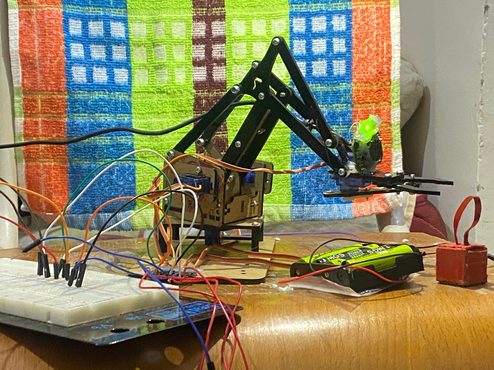

# Robotic Arm Object Sorting System



A 4-DOF robotic arm controller for Raspberry Pi that uses computer vision to detect, pick up, and sort objects (tomatoes and potatoes) into separate boxes.


## Features

- **Object Detection**: Uses OpenCV to detect red (tomatoes) and yellow/brown (potatoes) objects
- **4-DOF Arm Control**: Controls Base, Shoulder, Elbow, and Gripper servos
- **Automatic Sorting**: Sorts objects into designated boxes based on type
- **3D Simulation**: Realistic 3D visualization with Matplotlib (no hardware needed!)
- **Docker Support**: Easy deployment on Raspberry Pi

## Project Structure

```
se_project/
├── src/
│   ├── main.py           # Main control loop (hardware)
│   ├── motor_control.py  # Servo motor control
│   ├── vision.py         # Object detection
│   ├── simulation.py     # 2D simulation
│   └── simulation_3d.py  # 3D simulation with two-finger gripper
├── tests/
│   ├── verify_setup.py       # Vision & motor tests
│   ├── verify_kinematics.py  # Forward kinematics tests
│   └── verify_simulation.py  # Simulation logic tests
├── Dockerfile
├── docker-compose.yml
└── requirements.txt
```

##  Quick Start

### 1. Run the 3D Simulation (No Hardware Required)

```bash
pip install -r requirements.txt
python src/simulation_3d.py
```

You'll see:
- A **source box** with mixed tomatoes and potatoes
- A **4-DOF robotic arm** with two-finger gripper
- Automatic sorting into **Box A** (tomatoes) and **Box B** (potatoes)

### 2. Run on Raspberry Pi (With Hardware)

**Hardware Setup:**
| Servo | GPIO Pin |
|-------|----------|
| Base | 17 |
| Shoulder | 27 |
| Elbow | 22 |
| Gripper | 23 |
|
**Using Docker:**
```bash
docker-compose up --build
```

**Without Docker:**
```bash
pip install -r requirements.txt
python src/main.py
```

## 🔧 Configuration

### Servo Angles
Edit `src/motor_control.py` to adjust:
- `min_angle` / `max_angle` for each servo
- Default positions

### Object Detection
Edit `src/vision.py` to adjust:
- HSV color ranges for tomato/potato detection
- Minimum area threshold

##  Testing

```bash
# Run all tests
python tests/verify_setup.py
python tests/verify_kinematics.py
python tests/verify_simulation.py
```

##  Dependencies

- `opencv-python-headless` - Computer vision
- `gpiozero` - GPIO control
- `numpy` - Numerical operations
- `matplotlib` - 3D visualization

##  Controls (3D Simulation)

- **Rotate View**: Click and drag
- **Zoom**: Scroll wheel
- **Quit**: Close window

##  License

MIT License

##  Author

Ali Aqil